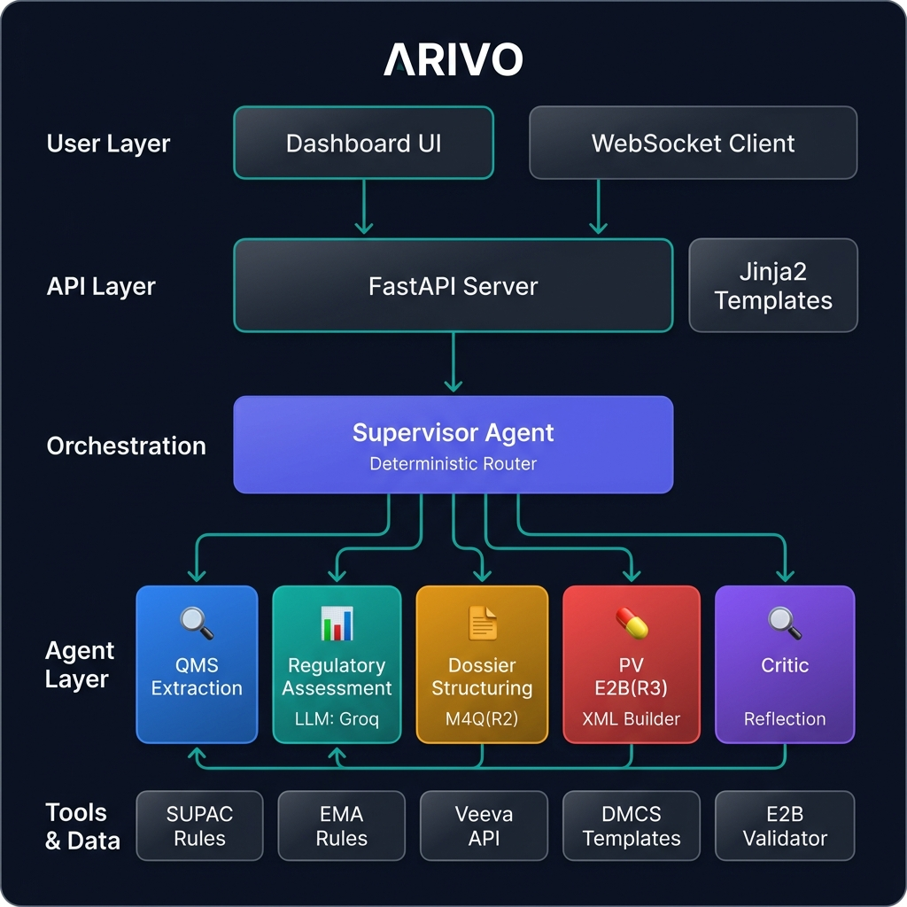
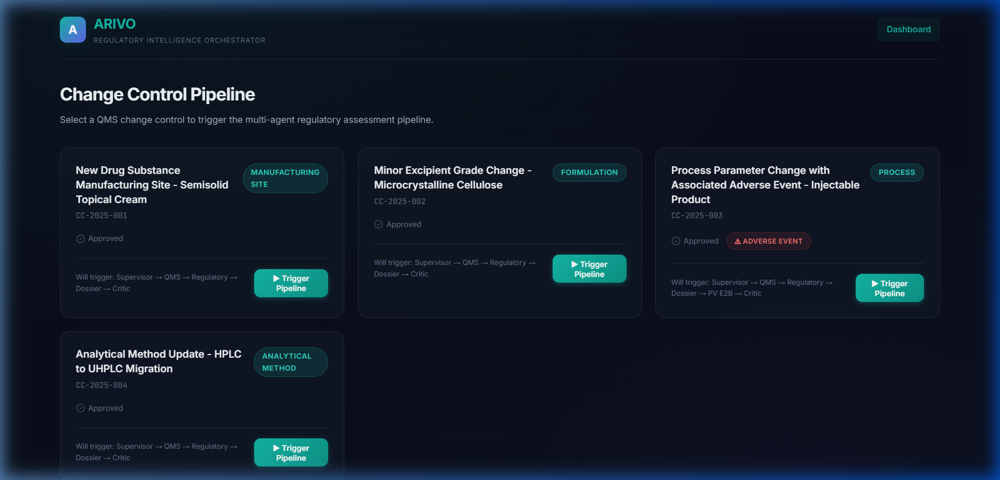
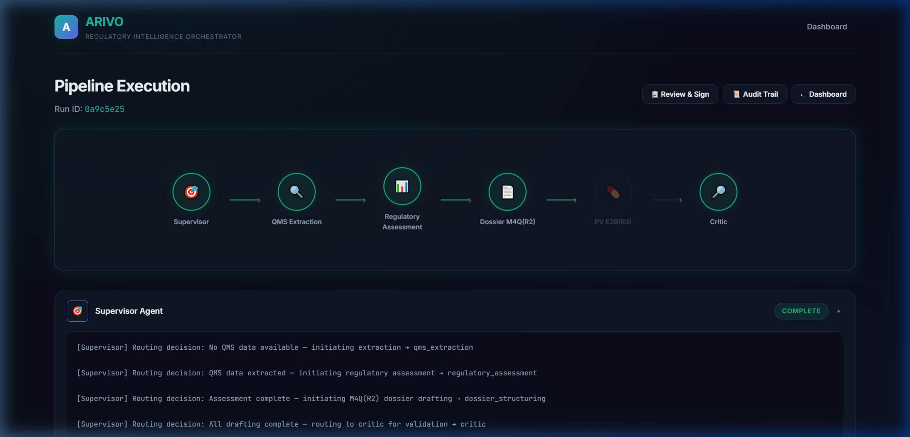
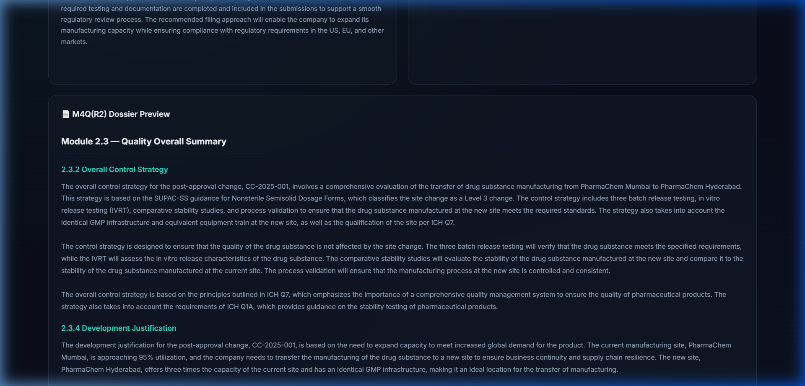
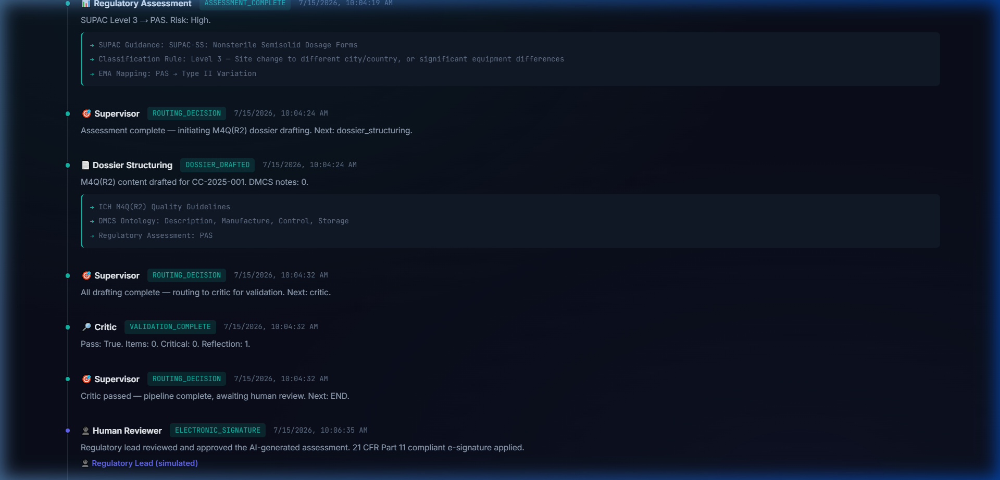
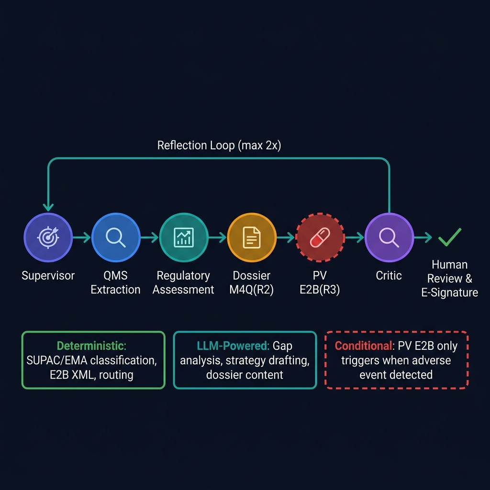
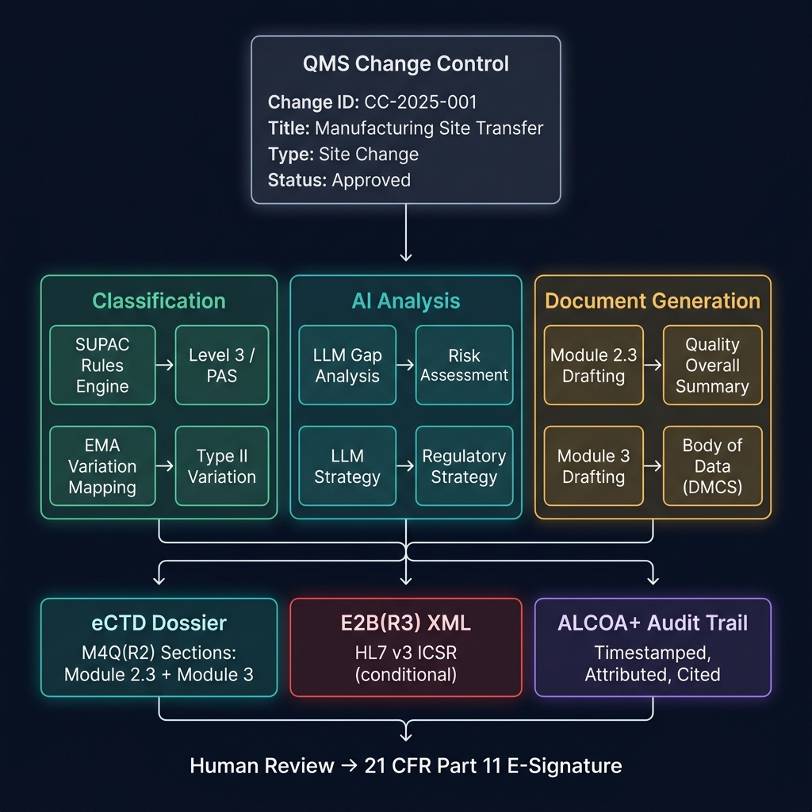

<div align="center">

# ARIVO

### Agentic Regulatory Intelligence & Variation Orchestrator

*A multi-agent AI system that automates the translation of pharmaceutical quality events into regulatory actions.*

[](https://python.org)
[](https://fastapi.tiangolo.com)
[](https://github.com/langchain-ai/langgraph)
[](https://groq.com)
[](https://docker.com)

</div>

---

## The Problem

Pharmaceutical companies face a **"missing middle"** in post-approval lifecycle management. When a quality event occurs (manufacturing site change, formulation update, adverse event), regulatory affairs teams must manually:

- Identify all affected global applications and specifications
- Classify the change under SUPAC (FDA) and EMA variation guidelines
- Draft ICH M4Q(R2) eCTD dossier sections
- Generate E2B(R3) ICSR reports for pharmacovigilance
- Maintain ALCOA+ compliant audit trails

This process is **slow, error-prone, and unscalable** — a single site change can take weeks of manual regulatory assessment across markets.

## The Solution

ARIVO is a **governed, multi-agent AI system** that automates this entire workflow. Unlike generic chatbots, it uses specialized agents with deterministic classification (for auditability) and LLMs (for narrative synthesis), orchestrated through a supervisor-driven pipeline.



---

## Key Features

### 🤖 Multi-Agent Pipeline (LangGraph)
Six specialized agents orchestrated by a **deterministic supervisor** — not a monolithic LLM prompt.

| Agent | Type | Responsibility |
|-------|------|---------------|
| **Supervisor** | Deterministic | Routes tasks based on pipeline state |
| **QMS Extraction** | Deterministic | Fetches change control data from Veeva Vault API |
| **Regulatory Assessment** | Hybrid | SUPAC/EMA classification (rules) + LLM gap analysis |
| **Dossier Structuring** | LLM-Powered | Drafts ICH M4Q(R2) Module 2.3 + Module 3 content |
| **PV E2B(R3)** | Deterministic | Generates HL7 v3 XML for adverse event reporting |
| **Critic** | Deterministic | Validates all outputs; reflection loop (max 2x) |

### 📊 Deterministic Regulatory Classification
SUPAC and EMA variation rules are **JSON-based, not LLM-generated** — ensuring reproducible, auditable outcomes required for GxP environments.

### 📄 ICH M4Q(R2) Dossier Drafting
LLM-powered drafting of eCTD sections organized by the **DMCS ontology** (Description, Manufacture, Control, Storage) for both Drug Substance and Drug Product.

### 💊 E2B(R3) Pharmacovigilance
Automatic ICSR generation in **HL7 v3 XML format** when adverse events are detected — conditionally routed, only triggered when needed.

### 🔐 Human-in-the-Loop Governance
Pipeline stops for human review before submission. **21 CFR Part 11** compliant electronic signature simulation.

### 📜 ALCOA+ Audit Trail
Every agent action logged with timestamp, attribution, citations to ICH guidelines, and source traceability.

---

## Screenshots

### Dashboard
Select a QMS change control and trigger the multi-agent pipeline with one click.



### Pipeline Execution
Real-time visualization of agent execution with expandable output panels.



### Review & Dossier Preview
Side-by-side regulatory assessment summary with full M4Q(R2) dossier preview.



### ALCOA+ Audit Trail
Complete audit trail with timestamped entries, citations, and electronic signatures.



---

## Architecture



**Design Principles:**

- **Deterministic routing** — Supervisor uses state-based logic, not LLM decisions, for predictable GxP workflows
- **Hybrid intelligence** — Rules engines for classification (auditable), LLMs for narrative synthesis (efficient)
- **Conditional branching** — PV E2B(R3) agent only activates when adverse events are detected
- **Reflection loop** — Critic validates all outputs and can route back for correction (max 2 cycles)



> See [architecture_diagram.md](architecture_diagram.md) for detailed diagrams.

---

## Tech Stack

| Layer | Technology | Why |
|-------|-----------|-----|
| **Orchestration** | LangGraph (StateGraph) | Conditional routing, checkpointing, human-in-the-loop |
| **LLM** | Groq `llama-3.3-70b-versatile` | Fast inference, open-source model, cost-effective |
| **Classification** | Custom JSON rules engine | Deterministic, auditable, GxP-compliant |
| **API** | FastAPI + Jinja2 | Async, auto-docs, server-side rendering |
| **Real-time** | WebSocket | Live pipeline event streaming |
| **Data Models** | Pydantic v2 | Runtime validation |
| **Deployment** | Docker + Compose | Reproducible demo |

---

## Quick Start

### Local Development

```bash
# 1. Clone
git clone https://github.com/suriyaprakash500/ARIVO.git
cd ARIVO

# 2. Virtual environment
python -m venv .venv
.venv\Scripts\activate       # Windows
# source .venv/bin/activate  # macOS/Linux

# 3. Install dependencies
pip install -r requirements.txt

# 4. Configure
copy .env.example .env
# Edit .env — add your GROQ_API_KEY

# 5. Run
python -m arivo.api.app
```

Open **http://localhost:8000** and click any **Trigger Pipeline** button.

### Docker

```bash
# Copy and edit .env first
docker-compose up --build
```

---

## Project Structure

```
ARIVO/
├── arivo/
│   ├── agents/              # LangGraph agent nodes
│   │   ├── graph.py         # Pipeline compilation
│   │   ├── supervisor.py    # Deterministic router
│   │   ├── qms_extraction.py
│   │   ├── regulatory_assessment.py
│   │   ├── dossier_structuring.py
│   │   ├── pv_e2b.py
│   │   └── critic.py
│   ├── api/                 # FastAPI server
│   ├── data/                # Mock fixtures + rules
│   ├── models/              # Pydantic schemas
│   └── tools/               # Business logic
├── frontend/                # Jinja2 templates + CSS/JS
├── docs/images/             # Architecture diagrams
├── Dockerfile
├── docker-compose.yml
└── requirements.txt
```

---

## Demo Scenarios

The system ships with **4 pre-built change control scenarios**:

| ID | Scenario | Agents Triggered | Key Features |
|----|----------|-----------------|--------------|
| CC-2025-001 | Manufacturing site transfer (semisolid) | All except PV | SUPAC Level 3, PAS filing, full M4Q(R2) dossier |
| CC-2025-002 | Excipient grade change (MCC) | All except PV | SUPAC Level 1, Annual Report, minimal impact |
| CC-2025-003 | Process change with adverse event | **All 6 agents** | PV E2B(R3) XML generation, endotoxin OOS |
| CC-2025-004 | HPLC to UHPLC method migration | All except PV | ICH Q2(R2) validation, method equivalence |

---

## Regulatory Standards Referenced

- **FDA SUPAC** — Scale-Up and Post-Approval Changes (IR, MR, SS)
- **EMA Variation Regulation** — Type IA, IB, II classification
- **ICH M4Q(R2)** — Common Technical Document, Quality module
- **ICH E2B(R3)** — Electronic transmission of ICSRs
- **ALCOA+** — Data integrity principles (Attributable, Legible, Contemporaneous, Original, Accurate + Complete, Consistent, Enduring, Available)
- **21 CFR Part 11** — Electronic records and signatures
- **ICH Q1A-Q14** — Quality guidelines referenced in dossier content

---

<div align="center">

Built for the future of pharmaceutical regulatory intelligence.

</div>
